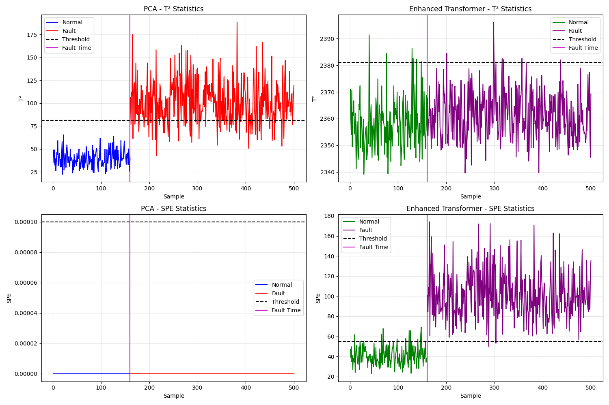
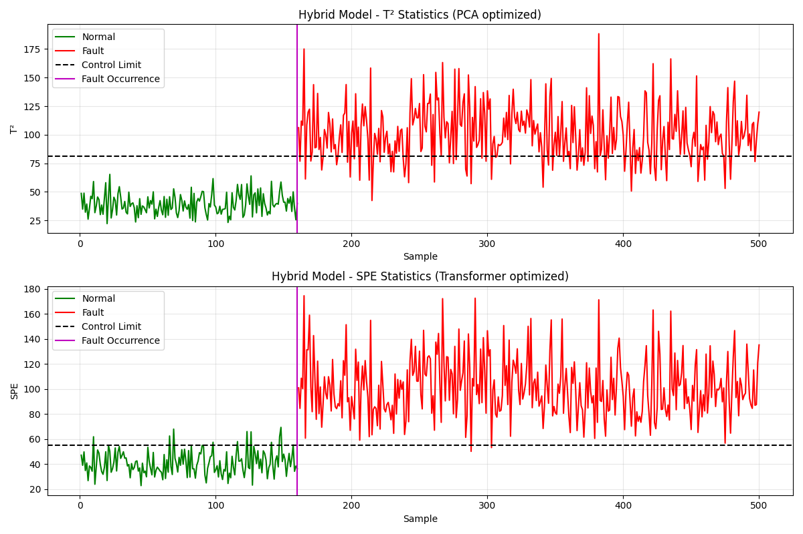

# Transformer-Based Process Fault Detection

A modern approach to industrial process monitoring and fault detection using Transformer neural networks.

## Project Overview

This project implements an industrial process fault detection system based on Transformer autoencoders and compares it with traditional PCA (Principal Component Analysis) methods. The system learns normal operation patterns from process data and detects anomalies using T² and SPE statistics.



## Key Features

- Transformer autoencoders for non-linear feature extraction and dimensionality reduction
- Kernel density estimation (KDE) for automatic determination of control limits
- T² and SPE statistics for fault detection
- Comparative analysis of Transformer and PCA methods
- Complete visualization and performance evaluation tools
- Enhanced Transformer model with weighted SPE metrics
- Hybrid approach combining PCA's T² with Enhanced Transformer's SPE metrics

## Performance Advantages

Compared to traditional PCA, our approach offers the following advantages:
- **Lower miss rate**: Fewer faults go undetected
- **Faster detection speed**: Faults can be detected earlier
- **Better non-linear processing capability**: Able to capture complex relationships in data
- **Optimal hybrid model**: Combines the strengths of both PCA and Transformer methods

## Getting Started

### Install Dependencies

```bash
pip install numpy matplotlib torch scipy scikit-learn joblib
```

### Quick Start

1. Train Transformer model:
   ```bash
   python transformer_autoencoder.py
   ```

2. Run fault detection:
   ```bash
   python transformer_kde_fault_detection.py
   ```

3. Run enhanced Transformer model:
   ```bash
   python enhanced_transformer_detection.py
   ```

4. Run hybrid detection model:
   ```bash
   python hybrid_detection.py
   ```

5. Compare with PCA:
   ```bash
   python comparison_detection.py
   ```

## Detailed Documentation

For complete usage instructions, methodology explanations and result analysis, please refer to [run_transformer.md](run_transformer.md).

## Key Files

- `transformer_autoencoder.py`: Original Transformer autoencoder model implementation
- `transformer_kde_fault_detection.py`: Transformer-based fault detection
- `enhanced_transformer_autoencoder.py`: Enhanced Transformer model with improved architecture
- `enhanced_transformer_detection.py`: Enhanced fault detection with weighted SPE metrics
- `hybrid_detection.py`: Hybrid approach combining PCA and Transformer strengths
- `comparison_detection.py`: Comparison between Transformer, Enhanced Transformer and PCA methods
- `run_transformer.md`: Detailed usage documentation
- `util.py`: Data loading and utility functions

## Results

### Original Transformer vs. PCA Comparison:

| Method      | T² False Alarm | SPE False Alarm | T² Miss Rate | SPE Miss Rate | T² Detection Time | SPE Detection Time |
|-------------|--------------|--------------|------------|------------|-----------------|----------------|
| PCA         | 1.25%        | 0.00%        | 5.29%      | 100.00%    | 6               | Not detected   |
| Transformer | 0.00%        | 1.25%        | 0.00%      | 17.06%     | 0               | 18             |

### Enhanced Transformer vs. PCA Comparison:

| Method            | T² False Alarm | SPE False Alarm | T² Miss Rate | SPE Miss Rate | T² Detection Time | SPE Detection Time |
|-------------------|--------------|--------------|------------|------------|-----------------|----------------|
| PCA               | 0.00%        | 0.00%        | 19.71%     | 100.00%    | 2               | Not detected   |
| Enhanced Transformer | 3.75%        | 6.88%        | 97.94%     | 0.59%       | Not detected     | 0               |

### Hybrid Model Performance:

| Method            | T² False Alarm | SPE False Alarm | T² Miss Rate | SPE Miss Rate | T² Detection Time | SPE Detection Time |
|-------------------|--------------|--------------|------------|------------|-----------------|----------------|
| PCA only          | 0.00%        | 0.00%        | 19.71%     | 100.00%    | 2               | Not detected   |
| Enhanced Transformer | 3.75%        | 6.88%        | 97.94%     | 0.59%       | Not detected     | 0               |
| Hybrid Model      | 0.00%        | 6.88%        | 19.71%     | 0.59%       | 2               | 0               |

The Hybrid Model combines:
- PCA-based T² calculation (low miss rate: 19.71%, quick detection: 2 samples)
- Enhanced Transformer-based SPE (excellent miss rate: 0.59%, immediate detection: 0 samples)

This hybrid approach provides the best of both methods:
- Immediate fault detection through SPE
- Reliable T² performance with low miss rate
- Complementary detection capabilities for different fault types



## License

MIT

## Citation

If you use this project in your research, please cite the following papers:

1. Vaswani, A., et al. (2017). "Attention is all you need."
2. Botev, Z. I., Grotowski, J. F., & Kroese, D. P. (2010). "Kernel density estimation via diffusion."


