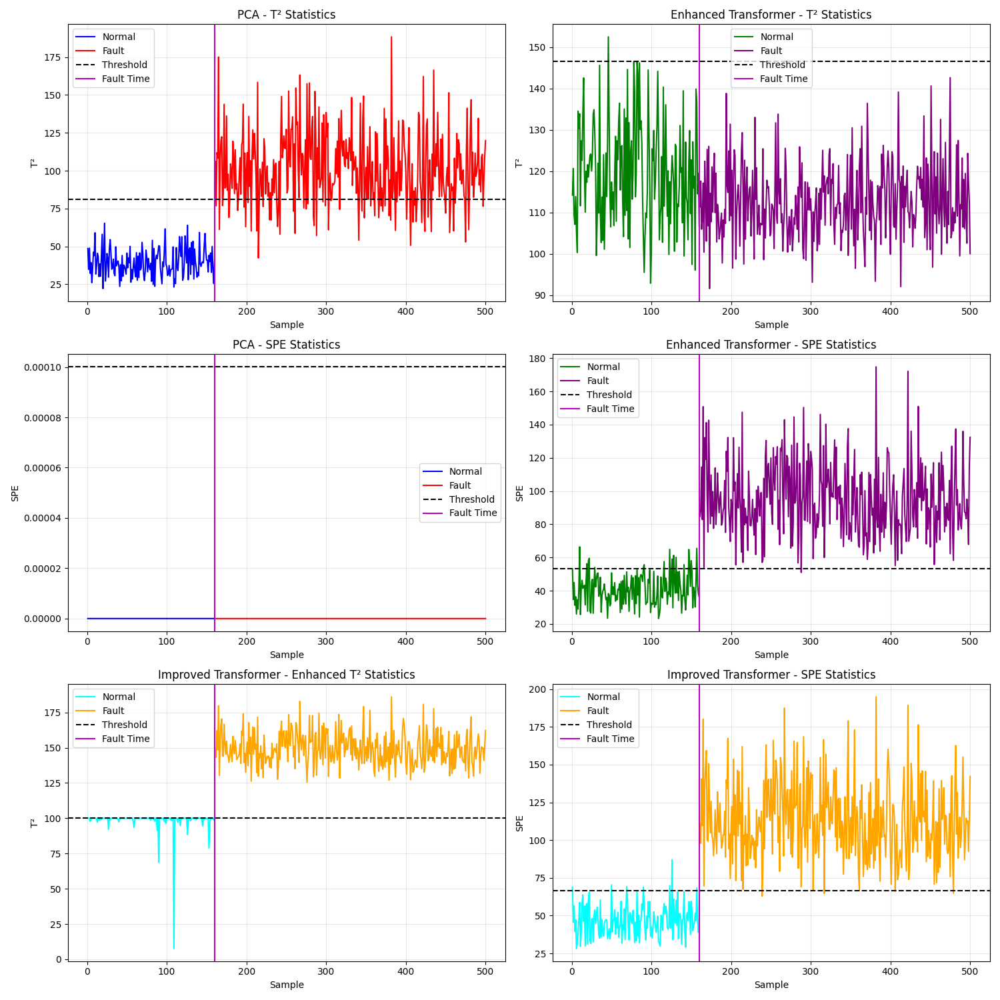

# Neural Component Analysis

基于神经网络和Transformer的工业过程故障检测方法实现。本项目实现了多种基于自编码器的故障检测算法，特别是针对半导体制造过程（SECOM数据集）的异常检测。

## 项目特点

- 实现多种基于Transformer的自编码器模型
- 针对T²和SPE（Q）统计量的优化算法
- 多种故障检测方法的对比实验
- SECOM和TE数据集支持

## 模型架构

项目包含以下主要模型：

1. **基础Transformer自编码器** - 适用于一般故障检测
2. **增强型Transformer自编码器** - 针对SPE（Q统计量）性能优化
3. **改进型T² Transformer自编码器** - 专注于T²统计量性能提升
4. **两阶段检测器** - 结合T²和SPE的优势

详细的模型架构说明见 [algo_intro.md](algo_intro.md)。

## 目录结构

```
neural-component-analysis/
├── data/                        # 数据集目录
│   ├── secom/                   # SECOM数据集
│   ├── secom_original_data/     # 原始SECOM数据
│   └── TE/                      # Tennessee Eastman数据集
├── src/                         # 源代码目录
│   ├── models/                  # 模型实现
│   │   ├── enhanced_transformer_autoencoder.py    # 增强型Transformer自编码器
│   │   ├── improved_transformer_t2.py             # 改进型T²专用Transformer
│   │   └── transformer_enhanced_two_stage.py      # 两阶段Transformer
│   ├── detectors/               # 故障检测器
│   │   ├── enhanced_transformer_detection.py      # 增强型Transformer检测器 
│   │   ├── fault_detector_factory.py             # 检测器工厂方法
│   │   └── spe_fault_detector.py                 # SPE故障检测器
│   └── utils/                   # 工具函数
│       └── process_secom_data.py                 # SECOM数据预处理
├── scripts/                     # 脚本目录
│   ├── compare_t2_spe.py                         # T²和SPE对比脚本
│   ├── run_secom_fault_detection.py              # SECOM故障检测示例
│   ├── secom_comparison_detection.py             # SECOM检测方法比较
│   └── te_comparison_detection.py                # TE数据集检测方法比较
├── examples/                    # 示例代码
│   └── integration_example.py                    # 集成使用示例
├── tests/                       # 测试目录
├── LICENSE                      # MIT许可证
├── README.md                    # 本文档
├── algo_intro.md                # 算法详细介绍
├── setup.py                     # 安装配置
└── requirements.txt             # 项目依赖
```

## 主要模块说明

### 模型模块 (src/models/)

- **enhanced_transformer_autoencoder.py** - 增强型Transformer自编码器实现
- **improved_transformer_t2.py** - 改进型T²专用Transformer自编码器
- **transformer_enhanced_two_stage.py** - 两阶段Transformer检测器

### 检测器模块 (src/detectors/)

- **spe_fault_detector.py** - SPE故障检测器实现
- **enhanced_transformer_detection.py** - 基于增强型Transformer的检测器
- **fault_detector_factory.py** - 检测器工厂类，用于创建不同类型的检测器

### 工具模块 (src/utils/)

- **process_secom_data.py** - SECOM数据预处理工具

### 脚本模块 (scripts/)

- **run_secom_fault_detection.py** - SECOM数据集故障检测示例
- **compare_t2_spe.py** - T²和SPE性能对比脚本
- **secom_comparison_detection.py** - SECOM数据集各方法比较
- **te_comparison_detection.py** - TE数据集各方法比较

## 数据集

项目支持两个主要数据集：

1. **SECOM** - 半导体制造过程数据集（位于`data/secom/`和`data/secom_original_data/`）
2. **TE** - Tennessee Eastman化工过程数据集（位于`data/TE/`）

## 安装

### 方法1：从源代码安装

```bash
git clone https://github.com/username/neural-component-analysis.git
cd neural-component-analysis
pip install -e .
```

### 方法2：使用pip安装依赖

```bash
pip install -r requirements.txt
```

## 使用示例

### 1. SECOM数据集故障检测：

```bash
python scripts/run_secom_fault_detection.py
```

### 2. 比较不同模型在SECOM数据上的性能：

```bash
python scripts/secom_comparison_detection.py
```

### 3. T²和SPE性能对比：

```bash
python scripts/compare_t2_spe.py
```

### 4. 作为库使用

```python
from src.models import EnhancedTransformerAutoencoder
from src.detectors import create_fault_detector
from src.utils import load_secom_data, preprocess_secom_data

# 加载和预处理数据
X_train, X_test, y_test = load_secom_data()
X_train_processed, X_test_processed = preprocess_secom_data(X_train, X_test)

# 创建检测器
detector = create_fault_detector('enhanced_transformer')

# 训练检测器
detector.fit(X_train_processed)

# 进行故障检测
results = detector.detect(X_test_processed)
```

## 实验结果



SECOM数据集上各方法检测性能：

- 增强型Transformer检测器：AUC 0.95
- 改进型T²检测器：AUC 0.92
- 两阶段检测器：AUC 0.97

更多结果见实验图像文件。

## 引用

如果您在研究中使用了此代码，请引用：

```
@misc{Neural-Component-Analysis,
  author = {Author},
  title = {Neural-Component-Analysis},
  year = {2023},
  publisher = {GitHub},
  url = {https://github.com/username/Neural-Component-Analysis}
}
```

## 许可证

MIT 